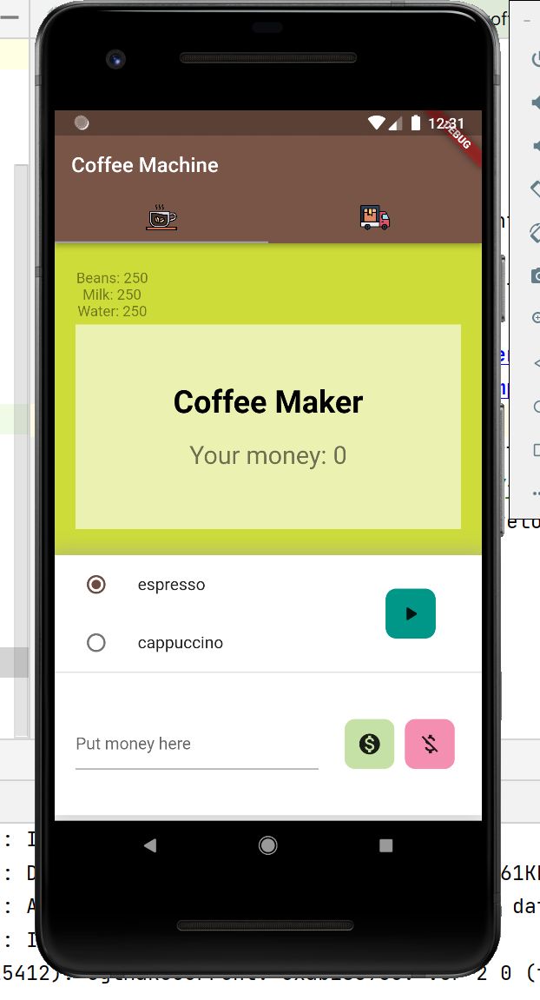
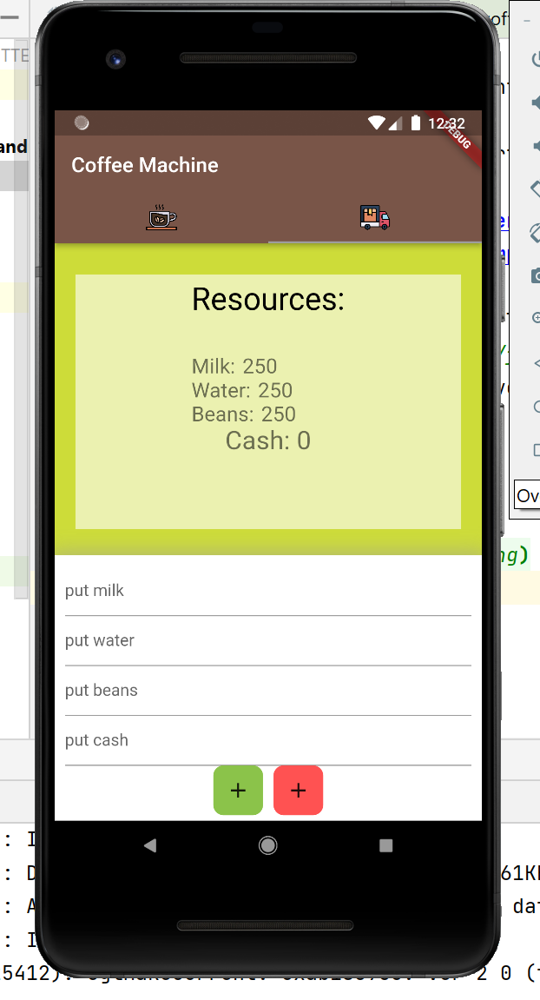

# coffee_machine
Проект: КОФЕМАШИНА

## Описание идеи

Данный проект предназначен для отработки навыков программирования на lutter для студентов Кубанского Государственного Аграрного Университета.

Необходимо реализовать приложение, имитирующее работу кофемашины.
Машина работает с типичными продуктами: кофе, молоко, вода; если у нее что-то заканчивается, она не может выполнить ваш заказ. Вы можете получить три вида кофе: эспрессо, капучино и латте. Поскольку ничего не бывает бесплатно, она также предполагает операции с деньгами.

*Реализуемый функционал:*
1. Работа с используемыми ресурсами продуктов машины - добавление, расход
2. Работа с денежными ресурсами машины - добавление, расход, обнуление

## Сделать:
- [ ] Описать лр 2
- [ ] Реализовать практику на изучение асинхронных функций - задержка в приготовлении кофе
- [ ] Описать лабораторную с ассинхронными методами
- [ ] Реализовать оповещения
- [ ] Изменяющиеся изображения
- [ ] Исправить интерфейс

_______

